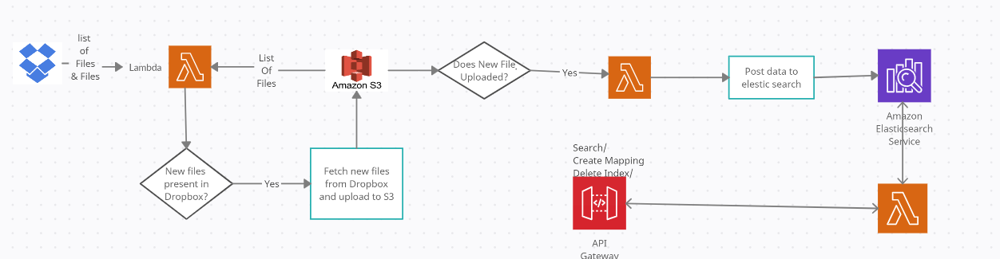

# Filesearch

A module writtin using [chalice](https://aws.github.io/chalice/) library to create lambda functions as well as API Gateway

## FlowDiagram


## Configuration

Use the package manager [pip](https://pip.pypa.io/en/stable/) to install packages.
```
1. create and activate virtual environment with python >= 3.7.2.
2. Install the libraries by running below commands.
3. pip install -r requirement.txt
4. And to deploy the application u need to configure some environment variable present in .chalice/config.json.
5. As well as you need to provide AWS IAM role arn which have ALL AWS S3 permission except delete(for easy job),
 lambda execute, cloudwatch logs and apigateway invoke full access
```
```
## Let see what environment variable need to be filled in .chalic/config.json and how to create them

1. ELASTICSEARCH_API_KEY_ID & ELASTICSEARCH_API_KEY_SECRET
do postrequest with something like below to get id & api_key value to ,
 you have to pass id to ELASTICSEARCH_API_KEY_ID & api_key to ELASTICSEARCH_API_KEY_SECRET environment variable.
POST /_security/api_key
{
  "name": "my-api-key",
  "expiration": "1d", 
  "role_descriptors": { 
    "role-a": {
      "cluster": ["all"],
      "index": [
        {
          "names": ["*"],
          "privileges": ["all"]
        }
      ]
    }
  }
}

2. ELASTICSEARCH_CLOUD_ID: it is CLOUD ID of elasticsearch
3. ELASTICSEARCH_INDEXNAME: indexname on which create & search operations will be performed.
4. BUCKET_NAME: bucket in which files will be dropped from dropbox and as well
 as files will be picked from here to post data to elaticsearch.
5. DROPBOX_DIRECTORY_PATH: path from where files need to be picked should be left empty if not required
(be careful shared directory from App works as base directory for external app).
6. DROPBOX_ACCESS_TOKEN: access token to access dropbox.
```

## Deploy
```python
chalice deploy --profile <aws-profile-name-if-not-default>
```

# Usage of Api Gateway
```
1. after running chalice deploy you will get "Rest API URL" save it.
2. for search do:
POST REQUEST ON: "Rest API URL SAVED BEFORE" + "/search?search=`anything you want to search`"
or do a a post request on "Rest API URL SAVED BEFORE" + "/search" with custom query in json format
3.To download a file:
do a GET request on "Rest API URL SAVED BEFORE" + '/download/{filename}'
4. create a mapping:
do a POST request on "Rest API URL SAVED BEFORE" + '/create-mapping' to create mapping whose format is present in
chalicelib/config/index_mapping.json file.
to create your own custom mapping do post request with custom mapping format in json format
5. to delete index:
do a POST request on "Rest API URL SAVED BEFORE" + '/delete_index'

```


# Internal Module Explanation
- present in chalicelib folder

## DropboxS3FileSyncer
```
This module is created  as a helper to lambda function to synchronize files between dropbox and s3.
Its working:
1. It takes a list of all files from dropbox if len(files)>1000 then it uses cursor token to get more files.
2. Also it takes list of all files from s3.
3. It then compares the list and those missing in S3 are uploaded to S3.
```
## ElasticsearchHelper 
```
It uses elasticsearch python library to perform following operations:
1. connect to elasticsearch.
2. create mapping.
3. searching
4. And deleting index.
```

# Lambda function and api Gateways
- Present in app.py files
```
1. dropbox_s3_sync: gets deployed as lambda function currently scheduled at every 5th min, change it based on
your need for hours use .HOURS instead of .MINUTES
2. s3_to_elasticsearch: lambda function which gets triggered when file is uploaded in s3
 bucket whose name is provided in environment variables.

Below are the api gatways:

3. search_elasticsearch: a function which gets converted to api gateway after deployed: 
its url will be url of particular api gateway uri + '/search'.
4. delete_index: to delete index: 
url: api url + /delete_index
the index provided in environment variables will be deleted
5. create_mapping: to create mapping
url: api + /create-mapping
mapping will be created based on config file in chalicelib/config/index_mapping.json
or to create custom mapping pass a custom mapping in json format.
6. download: return a presigned s3 url 
url: api + /download / filename-to-download
```
